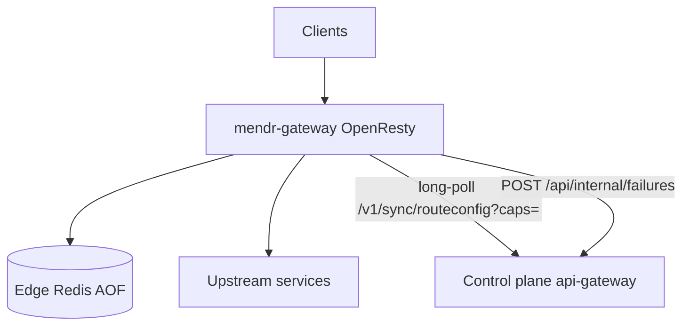

# Mendr Data Plane

OpenResty/Lua edge gateway that terminates customer traffic, applies policy from
local Redis snapshots, and runs deterministic MendrScript JSON transforms at line
rate. Paired with the cloud/on-prem **mendr-control-plane**; proxy traffic stays
local except for an optional Java fallback.

Components:

- `mendr-gateway` — OpenResty + LuaJIT (`infra/nginx`)
- `mendr-edge-redis` — local AOF snapshot cache

---

## What this edge does

1. **Proxy** — envelope (`POST /api/gateway/proxy`) or transparent HTTP ingress
2. **Policy** — WAF, JWT/OIDC, rate limit, AI gateway quotas, LB / circuit breaker
3. **Transform** — closed-opcode MendrScript via streaming splice or full DOM
4. **Observe** — failure reports, usage, OTel; sync route/rule snapshots from the control plane

The edge **never** runs LLM-generated code. It only executes compiled, verified
programs from capability-gated snapshots.

---

## Architecture (current)



### Hot path (`proxy_core.lua`)

1. Resolve route snapshot (`mendr:routeconfig:{source}:{target}:{endpoint}`)
2. CORS / origin override
3. WAF + geo/IP + body-size
4. Consumer JWT / OIDC / introspection
5. Abuse + route/tenant rate limit
6. AI TPM/RPM, prompt firewall, semantic cache (when applicable)
7. Request transform if the request program is non-empty
8. Response-cache HIT for GET/HEAD
9. `peer_resolver` — healthy pool, canary, mirror, timeouts, retries
10. `proxy_pass` (concrete URL or named upstream `mendr_dynamic`)
11. `header_filter` / `body_filter` / `log`

### Two front doors

| Mode | Entry | Notes |
|------|--------|--------|
| **Envelope** | `POST /api/gateway/proxy` | SDK / mesh JSON envelope |
| **Transparent ingress** | `location /` when `MENDR_INGRESS_ENABLED=true` | Real HTTP; identity via `X-Mendr-Key` or host map → radixtree → `proxy_core` |

Cold/degraded edges can set `javaFallback` and forward the envelope to the
control plane's Java proxy so traffic is not black-holed.

### Shared memory (`lua_shared_dict`)

| Dict | Use |
|------|-----|
| `mendr_sync_state` | sync `last_version`, ingress rebuild lock |
| `mendr_lb_rr` | round-robin cursor |
| `mendr_circuit_breaker` | breaker + active HC |
| `mendr_rate_limit` | quotas, abuse, bot, AI TPM |
| `mendr_response_cache` | L1 + AI semantic cache |
| `mendr_metrics` | Prometheus counters |
| `mendr_jwks` | JWKS + secret TTL |
| `mendr_splice_trie` | pointer-trie cache by `programHash` |
| `dedup_cache` | failure / validate / edge-obs dedup |

---

## Worker sync (ingress radixtree)

Worker **0** long-polls `/v1/sync/routeconfig`, writes Redis, rebuilds its local
host + pair trees, and bumps shared `last_version`.

**Every worker** calls `ingress_routing.ensure_fresh()` at the start of
`match()` / `match_pair()`:

1. Compare shared `last_version` to the worker-local version
2. On mismatch, try `ingress:rebuild_lock` (`shared:add`, TTL 5s)
3. Winner: `reload_from_redis` (host tables + `mendr:ingress:pair_keys`, with a
   `KEYS mendr:routeconfig:*` fallback if the pair index is missing)
4. Loser: brief wait, then one immediate reload attempt; otherwise serve LKG
5. Pair rebuild failure **does not** advance the local version (worker keeps
   retrying); shared version still bumps so other workers catch up hosts

`ingress.lua` retries once with an explicit `ensure_fresh()` on cold-worker
`NO_TREE`. Specs: `infra/nginx/lua/spec/ingress_sync_spec.lua` (+ CI workflow
`.github/workflows/lua-specs.yml`).

---

## Streaming transforms (`body_filter` / `splice`)

Programs are re-classified on the edge (`plan_class.lua`):

`PASSTHROUGH` < `PREFILTERABLE` < `FORWARD_ONLY` < `BOUNDED_WINDOW` < `UNBOUNDED`

| Class | Behavior |
|-------|----------|
| no rewrite needed | true chunk passthrough |
| `PREFILTERABLE` miss | skip transform |
| `FORWARD_ONLY` / `PREFILTERABLE` / `BOUNDED_WINDOW` | `splice.lua` HBM streaming rewrite |
| `UNBOUNDED`, conditionals, response-contract routes | buffer to EOF → DOM `transform.apply_program` |
| splice fault **before** flush | spill to DOM / original |
| splice fault **after** flush | **protocol-aware abort** (not a clean truncated 200) |

**Hold until EOF** for value-mutating / unwrap / bounded-window programs so
fail-closed cannot torn-page after the first drain.

**After-flush abort** (`abort_incomplete_response`):

- HTTP/1.x → `ngx.arg[1]=nil`; `return ngx.ERROR`
- HTTP/2+ → controlled Lua `error(...)` (never `ngx.ERROR` under H2)
- Sets `splice_abort_after_flush`, category `SPLICE`, problem-detail (502), metric
- `log.lua` still POSTs a failure report even when `ngx.status` is 200

Conditionals are classified by branch union but **always execute on DOM** (the
scanner cannot evaluate predicates). That is intentional, not a regression.

---

## Failure telemetry & dedup

`log.lua` (timer):

- POST `/api/internal/failures` (PII-redacted)
- Dedup via `dedup.lua`: atomic `shared:add` on
  `fail:{source}:{target}:{endpoint}:{category}` (endpoint is the route
  template on ingress; envelope path canonicalizes via `match_pair` when possible)
- Optional suppressed-count on the next successful report
- Async contract validation, usage, OTel, bot bursts, cache store

---

## Sync contract (edge ← control plane)

Long-poll: `GET /v1/sync/routeconfig?since=&caps=`

Capability tokens include: `v2`, `ingress`, `traffic`, `ratelimit`, `authz`,
`cache`, `metrics`, `ai`, `waf`, `splice`.

Edges without `v2` never receive DSL-only (`ops[]`) routes. Edges without
`splice` get `planClass` stripped and `streamable=false` (DOM path).

Payload: `version`, `routes`, `removed`, plus optional `ingressTables` /
`apiKeys` / `hostIdentity` / `aiRoutes`. Sync also maintains
`mendr:ingress:pair_keys` for lazy pair-tree rebuild on non-0 workers.

---

## Run

```powershell
docker compose up -d --build
```

Gateway listens on **8080** (proxy), and optionally **80** / **443** for ingress + ACME.

### Required environment

| Variable | Purpose |
|----------|---------|
| `MENDR_CONTROL_PLANE_URL` | Control plane base URL |
| `GATEWAY_EDGE_API_KEY` | Per-tenant edge key (`<prefix>.<secret>`) — preferred SaaS credential |
| `MENDR_TENANT_ID` | Optional defense-in-depth `X-Tenant-Id` |
| `GATEWAY_INTERNAL_API_KEY` | Legacy shared internal key |

### Transparent ingress

| Variable | Purpose |
|----------|---------|
| `MENDR_INGRESS_ENABLED=true` | Catch-all ingress location |
| `MENDR_HOST_IDENTITY_FALLBACK` | Host map when `X-Mendr-Key` absent |
| `MENDR_TLS_REQUIRED=true` | Reject non-HTTPS (except ACME HTTP-01) |
| `MENDR_ACME_*` | In-edge Let's Encrypt (`ENABLED`, `EMAIL`, `DOMAINS`, `STAGING`) |

### Other useful flags

- `MENDR_JAVA_FALLBACK` — allow Java proxy fallback when the tree is not ready
- `MENDR_FULL_RESYNC_INTERVAL_SEC` — periodic full resync backstop (default 300)
- `MENDR_EDGE_OBSERVATION_*` — sampled topology edge reporting (off by default)
- `MENDR_WAF_CORAZA=true` — Coraza + CRS when installed by the image entrypoint

---

## Multi-tenant edge onboarding

1. Issue a per-tenant API key in the control plane; register the edge.
2. Deploy with `GATEWAY_EDGE_API_KEY=<prefix>.<secret>` (optional `MENDR_TENANT_ID`).
3. Sync authenticates with `X-Api-Key`; the control plane scopes snapshots to that tenant.

Each edge is single-tenant; local Redis never mixes tenants.

---

## Lua specs / CI

```bash
cd infra/nginx/lua
LUA_BIN=lua5.1 bash spec/run_all.sh
```

GitHub Actions: `.github/workflows/lua-specs.yml` (lua5.1 + lua-cjson on changes
under `infra/nginx/lua/**`). Specs stub `ngx` / `resty.*`; they are unit coverage,
not a full OpenResty integration test.

Notable specs for consistency work:

- `spec/ingress_sync_spec.lua` — ensure_fresh, lock, NO_TREE retry, pair_keys SCAN, version rollback
- `spec/body_filter_abort_spec.lua` — hold_output + H1/H2 abort

---

## What this repo is not

Postgres, Kafka, AI analysis, rule engine, and the dashboard live in
**mendr-control-plane**. This repo is the customer-edge gateway + local Redis only.
